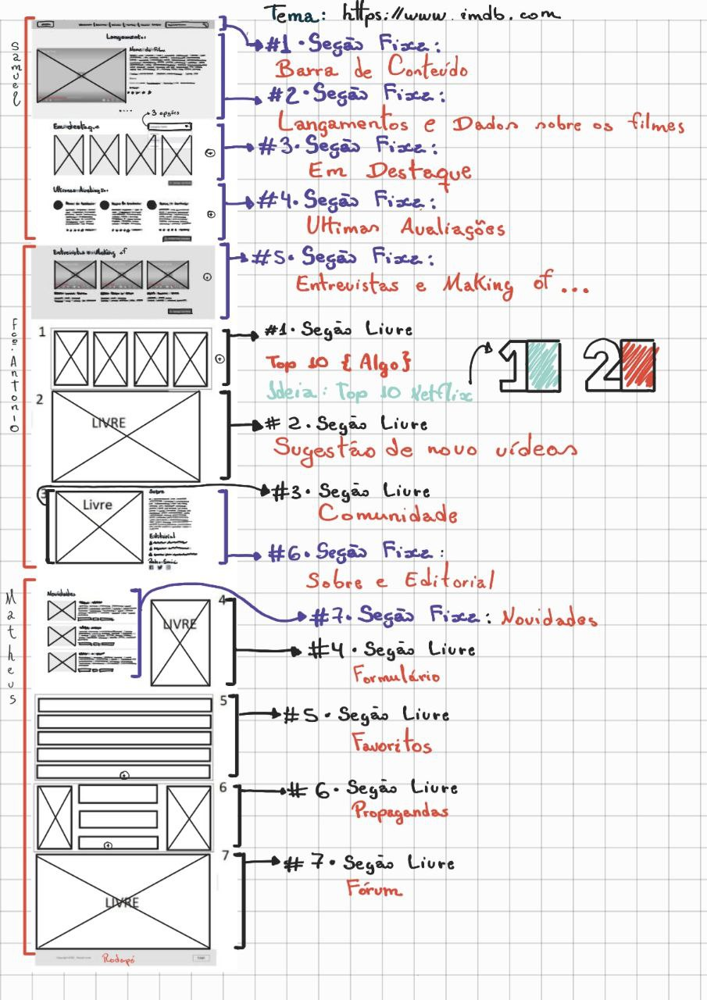

# Trabalho Prático 1
## Criação de layout para um sistema de vídeos

Os alunos devem seguir as seguinte regras:

Você deve seguir o layout (Wireframe) disponibilizado como referência para a criação do site.

Sugere-se que você crie o site  do grupo algum tema de interesse.

O grupo deve utilizar imagens reais que simulem filmes que de fato existem.

O site a ser criado nesse trabalho é totalmente estático apenas com uso de HTML e CSS.

As partes livres devem conter, conforme a escolha do grupo os seguintes itens:
- Comunidades de vídeos temáticos 
- Fórum de comentários e discussões sobre os vídeos
- Propagandas
- Sugestões de novos vídeos
- Top 10 vídeos no momento
- Criação de uma lista de favoritos por usuário
- Formulário para cadastro de informações sobre os  vídeos postado na comunidade de vídeos temáticos

### Divisão do wireframe do site por integrante

### Organização do trabalho

- Evitar utilizar seletor de tag, para que estilos não sejam sobrepostos;
- Cada seção do site deve ser uma tag section dentro do conteúdo da tag main, ou uma tag aside, fora da main, para conteúdos secundários;
- Ao concluir uma seção deve ser feita a versão responsiva dela dentro do media query;